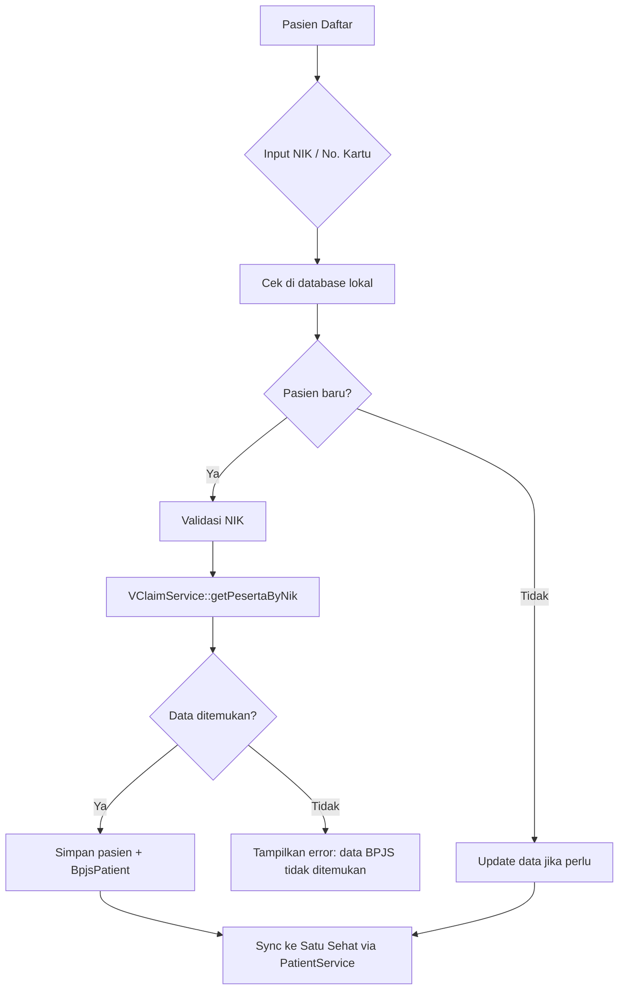
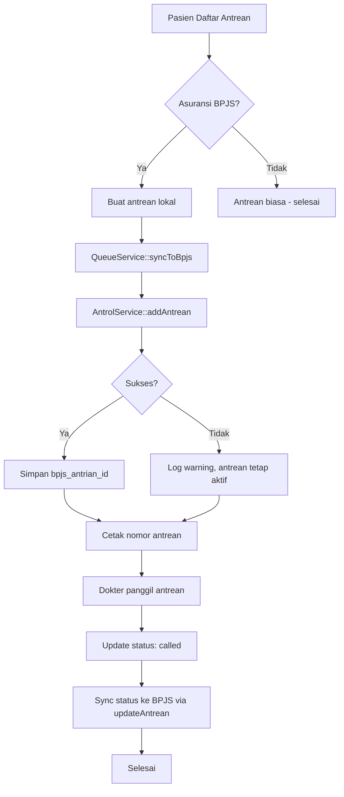
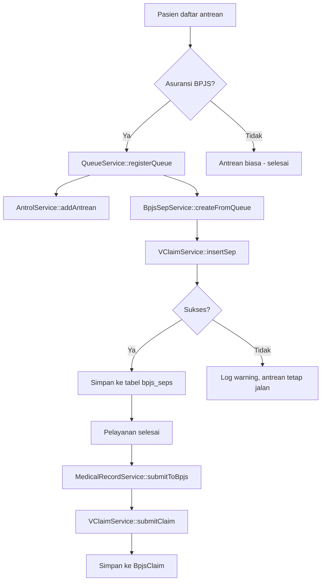
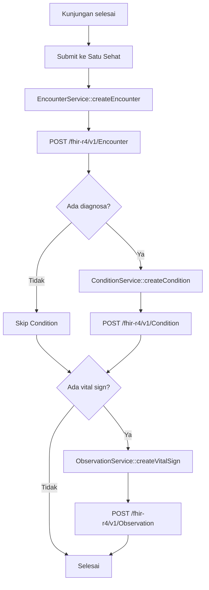
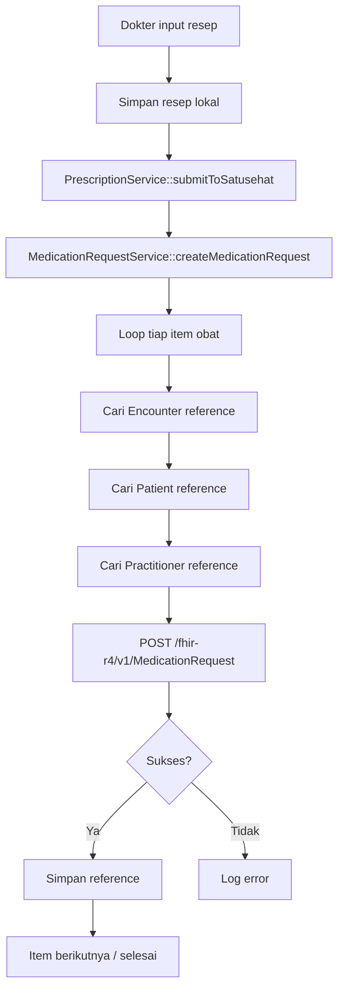
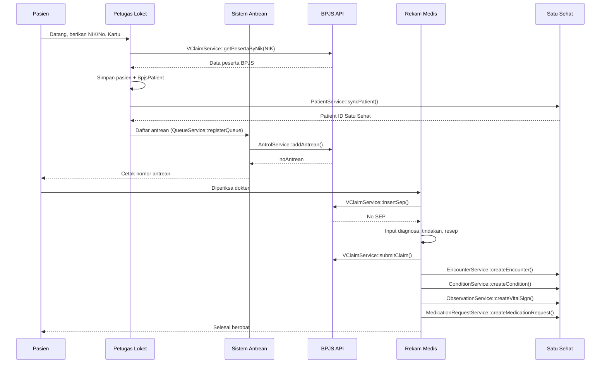

# Panduan Implementasi & Integrasi Modul Bridging BPJS dan Satu Sehat

---

## 1. Pendahuluan

### 1.1 Tujuan Dokumen

Dokumen ini adalah panduan teknis implementasi dan integrasi modul **BPJS Kesehatan** (VClaim, Antrol, Aplicares) dan **Satu Sehat Kemenkes** (FHIR R4) ke dalam sistem e-Klinik. Dokumen ini ditujukan untuk _Laravel developer_ yang akan melakukan integrasi, konfigurasi, dan troubleshooting sistem bridging.

### 1.2 Gambaran Umum Arsitektur Bridging

```
┌─────────────────────────────────────────────────────────────────┐
│                       e-Klinik System                           │
│                                                                 │
│  ┌──────────────┐  ┌──────────────┐  ┌──────────────────────┐  │
│  │ BPJS Module   │  │ Satu Sehat   │  │ iCare Module         │  │
│  │              │  │ Module       │  │                      │  │
│  │ - VClaim     │  │ - Patient    │  │ - Patient History    │  │
│  │ - Antrol     │  │ - Encounter  │  │ - Medication History │  │
│  │ - Aplicares  │  │ - Condition  │  │ - Diagnosis History  │  │
│  │              │  │ - Observation│  │                      │  │
│  └──────┬───────┘  │ - Medication │  └──────────────────────┘  │
│         │          │   Request    │                             │
│         │          │ - Practitioner│                            │
│         │          │ - Organization│                            │
│         │          └──────┬───────┘                             │
│         │                 │                                     │
│         └─────────────────┼─────────────────────────────────────┘
│                           │
└───────────────────────────┼─────────────────────────────────────┘
                            │
              ┌─────────────┴─────────────┐
              │                           │
   ┌──────────▼──────────┐    ┌──────────▼──────────┐
   │  BPJS Kesehatan      │    │  Satu Sehat           │
   │  (apijkn.bpjs-       │    │  (api.satusehat.      │
   │   kesehatan.go.id)   │    │   kemkes.go.id)       │
   └─────────────────────┘    └───────────────────────┘
```

### 1.3 Prasyarat Teknis

| Komponen | Versi / Keterangan |
|----------|-------------------|
| PHP | 8.3 atau lebih baru |
| Laravel | 13.x |
| Database | MySQL 8.0+ / MariaDB 10.6+ |
| HTTP Client | Guzzle (terintegrasi di Laravel) |
| Ekstensi PHP | `openssl`, `json`, `mbstring`, `bcmath` |
| Credentials BPJS | `cons_id`, `secret_key`, `user_key` (dari BPJS Kesehatan) |
| Credentials Satu Sehat | `client_id`, `client_secret`, `organization_id` (dari portal Satu Sehat) |
| iCare | API Key dan kode faskes (dari Kemenkes) |

---

## 2. Konfigurasi Awal

### 2.1 BPJS Kesehatan

#### 2.1.1 Mendapatkan Credentials

Credential BPJS didapatkan setelah mengajukan permohonan akses ke BPJS Kesehatan:

1. Ajukan permohonan via portal **dvlp.bpjs-kesehatan.go.id**
2. Pilih modul yang akan digunakan (VClaim, Antrol, Aplicares)
3. Dapatkan **cons_id** (Consumer ID) dan **secret_key**
4. Dapatkan **user_key** untuk autentikasi tambahan
5. BPJS akan memberikan base URL sesuai environment (development/production)

#### 2.1.2 Konfigurasi `.env`

```env
# ─── BPJS Kesehatan ────────────────────────────────────
BPJS_CONS_ID=12345
BPJS_SECRET_KEY=yourSecretKeyHere
BPJS_USER_KEY=yourUserKeyHere
BPJS_BASE_URL=https://apijkn.bpjs-kesehatan.go.id
```

Konfigurasi ini dibaca oleh `config/bpjs.php`:

```php
// config/bpjs.php
return [
    'cons_id' => env('BPJS_CONS_ID', ''),
    'secret_key' => env('BPJS_SECRET_KEY', ''),
    'base_url' => env('BPJS_BASE_URL', 'https://apijkn.bpjs-kesehatan.go.id'),
    'user_key' => env('BPJS_USER_KEY', ''),

    'vclaim' => [
        'base_url' => env('BPJS_VCLAIM_BASE_URL', 'https://apijkn.bpjs-kesehatan.go.id/vclaim-rest'),
        'peserta' => '/Peserta',
        'sep' => '/SEP',
        'claim' => '/Claim',
        'referensi' => '/referensi',
    ],

    'antrol' => [
        'base_url' => env('BPJS_ANTROL_BASE_URL', 'https://apijkn.bpjs-kesehatan.go.id/antreanrs'),
        'antrean' => '/antrean',
        'jadwal' => '/jadwal',
        'dashboard' => '/dashboard',
    ],

    'aplicares' => [
        'base_url' => env('BPJS_APLICARES_BASE_URL', 'https://apijkn.bpjs-kesehatan.go.id/aplicares'),
        'referensi' => '/ref',
        'faskes' => '/faskes',
    ],
];
```

#### 2.1.3 Testing Koneksi

Gunakan `VClaimService` untuk test panggil API referensi diagnosa:

```php
use App\Services\BPJS\VClaimService;

$vclaim = app(VClaimService::class);

// Cari diagnosa ICD-10 berdasarkan kode
$diagnosa = $vclaim->getDiagnosa('A00');

// Cari data peserta berdasarkan nomor kartu
$peserta = $vclaim->getPeserta('0001234567890', now()->format('Y-m-d'));

// Cari data peserta berdasarkan NIK
$pesertaByNik = $vclaim->getPesertaByNik('3201234567890001', now()->format('Y-m-d'));
```

Response dari BPJS akan otomatis di-dekripsi oleh `BPJSHttpClient::decryptResponse()` menggunakan AES-256-CBC.

### 2.2 Satu Sehat Kemenkes

#### 2.2.1 Mendapatkan Credentials via KYC

Proses registrasi aplikasi di Satu Sehat:

1. Daftar dan login ke **https://satusehat.kemkes.go.id**
2. Lakukan **KYC (Know Your Customer)** — upload dokumen legal klinik (NIB, Surat Izin Operasional)
3. Setelah KYC disetujui, buat **Aplikasi Baru** di dashboard developer
4. Dapatkan **Client ID** dan **Client Secret**
5. Dapatkan **Organization ID** (identitas faskes Anda di Satu Sehat)
6. Catat **KYC Endpoint URL** yang diberikan

#### 2.2.2 Konfigurasi `.env`

```env
# ─── SATUSEHAT Kemenkes RI ─────────────────────────────
SATUSEHAT_CLIENT_ID=yourClientId
SATUSEHAT_CLIENT_SECRET=yourClientSecret
SATUSEHAT_ORGANIZATION_ID=10000012345
SATUSEHAT_BASE_URL=https://api.satusehat.kemkes.go.id/fhir-r4/v1
SATUSEHAT_AUTH_URL=https://api-satusehat.kemkes.go.id/oauth2/v1
SATUSEHAT_KYC_URL=https://api-satusehat.kemkes.go.id/kyc/v1
SATUSEHAT_TIMEOUT=30
```

Konfigurasi ini dibaca oleh `config/satusehat.php`:

```php
// config/satusehat.php
return [
    'base_url' => env('SATUSEHAT_BASE_URL', 'https://api.satusehat.kemkes.go.id/fhir-r4/v1'),
    'auth_url' => env('SATUSEHAT_AUTH_URL', 'https://api-satusehat.kemkes.go.id/oauth2/v1'),
    'client_id' => env('SATUSEHAT_CLIENT_ID', ''),
    'client_secret' => env('SATUSEHAT_CLIENT_SECRET', ''),
    'organization_id' => env('SATUSEHAT_ORGANIZATION_ID', ''),
    'kyc_endpoint' => env('SATUSEHAT_KYC_URL', ''),
    'timeout' => env('SATUSEHAT_TIMEOUT', 30),
];
```

#### 2.2.3 Testing Koneksi — Dapatkan Access Token

Gunakan `AuthService` untuk mendapatkan access token:

```php
use App\Services\SatuSehat\AuthService;

$auth = app(AuthService::class);
$token = $auth->getAccessToken();

echo $token;
// Output: eyJhbGciOiJSUzI1NiIs...
```

Atau via command:

```bash
php artisan tinker
> $token = app(\App\Services\SatuSehat\AuthService::class)->getAccessToken();
> echo $token;
```

Validasi organization ID:

```php
use App\Services\SatuSehat\OrganizationService;

$orgService = app(OrganizationService::class);
$result = $orgService->validateOrganization();

if ($result['valid']) {
    echo "Organization valid: " . $result['organization']['name'];
} else {
    echo "Error: " . $result['message'];
}
```

Alur autentikasi Satu Sehat di-handle oleh `AuthService`:

```
┌──────────────┐         ┌─────────────────┐         ┌───────────────┐
│  AuthService  │ ──────> │  POST /oauth2/   │ ──────> │  Cache Token  │
│  .getAccess   │         │  v1/accesstoken  │         │  (60 detik    │
│  Token()      │ <────── │  grant_type=     │ <────── │  sebelum      │
│               │         │  client_credentials │       │  expired)     │
└──────────────┘         └─────────────────┘         └───────────────┘
```

Token akan di-cache dan auto-refresh jika mendekati expired.

### 2.3 Autentikasi API & Role Middleware

#### 2.3.1 Sanctum (API Auth)

Seluruh route `/api/v1/*` dilindungi oleh middleware `auth:sanctum`. Untuk mengakses API, klien harus menyertakan token Bearer:

```bash
# 1. Dapatkan token (via endpoint login atau tinker)
curl -X POST "http://localhost:8000/sanctum/token" \
  -H "Accept: application/json" \
  -d "email=admin@eklinik.test&password=*123&device_name=testing"

# 2. Gunakan token di setiap request
curl -X GET "http://localhost:8000/api/v1/bpjs/vclaim/peserta?noKartu=..." \
  -H "Authorization: Bearer {token}"
```

Sanctum dikonfigurasi di `config/sanctum.php`:
- Stateful domains: `localhost:8000`, `127.0.0.1:8000`
- Token expiry: none (default)

Pastikan `APP_URL` di `.env` sesuai dengan domain yang digunakan agar Sanctum dapat memvalidasi cookie session.

#### 2.3.2 Role Middleware

Akses ke route web (Blade) berdasarkan peran pengguna (role). Middleware `role` diterapkan di `routes/web.php`:

| Role | Hak Akses |
|------|-----------|
| `admin` | Semua fitur (full access) |
| `doctor` | RME, diagnosa, resep, antrean, lab |
| `pharmacist` | Obat, inventori, resep |
| `cashier` | Pendaftaran pasien & antrean |
| `laborant` | Master lab, permintaan, hasil lab |

Penerapan di route group:
```php
Route::middleware(['auth', 'verified', 'role:admin,laborant'])->group(function () {
    Route::resource('lab-test-categories', LabTestCategoryController::class);
});
```

Middleware didaftarkan di `bootstrap/app.php`:
```php
->withMiddleware(function (Middleware $middleware) {
    $middleware->alias([
        'role' => \App\Http\Middleware\RoleMiddleware::class,
    ]);
})
```

#### 2.3.3 CORS

CORS dikonfigurasi di `config/cors.php` untuk mengizinkan akses dari origin mana pun ke route `api/*` dan `sanctum/csrf-cookie`:

```php
return [
    'paths' => ['api/*', 'sanctum/csrf-cookie'],
    'allowed_origins' => ['*'],
    'supports_credentials' => true,
];
```

---

## 3. Integrasi BPJS ke Fitur-Fitur

### 3.1 Manajemen Pasien → BPJS

#### 3.1.1 Validasi Peserta BPJS Saat Pendaftaran

Saat pasien mendaftar dengan jenis asuransi BPJS, sistem akan otomatis memvalidasi data ke BPJS.

**Flow:**



**Kode implementasi di `PatientService@register`:**

```php
// app/Services/PatientService.php

namespace App\Services;

use App\Models\BpjsPatient;
use App\Models\Patient;
use App\Services\BPJS\VClaimService;
use App\Services\SatuSehat\PatientService as SatuSehatPatientService;
use Illuminate\Support\Facades\DB;
use Illuminate\Support\Facades\Log;

class PatientService
{
    protected VClaimService $vClaimService;
    protected SatuSehatPatientService $satuSehatPatientService;

    public function __construct(
        ?VClaimService $vClaimService = null,
        ?SatuSehatPatientService $satuSehatPatientService = null
    ) {
        $this->vClaimService = $vClaimService ?? app(VClaimService::class);
        $this->satuSehatPatientService = $satuSehatPatientService ?? app(SatuSehatPatientService::class);
    }

    public function register(array $data): Patient
    {
        return DB::transaction(function () use ($data) {
            $patient = Patient::create($data);

            // Jika BPJS, simpan data kartu dan validasi
            if ($patient->insurance_type === 'BPJS' && !empty($data['insurance_number'])) {
                BpjsPatient::create([
                    'patient_id' => $patient->id,
                    'no_kartu' => $data['insurance_number'],
                    'status' => 'active',
                ]);

                try {
                    $this->checkBpjsStatus($patient);
                } catch (\Exception $e) {
                    Log::warning('Gagal validasi BPJS saat registrasi', [
                        'patient_id' => $patient->id,
                        'error' => $e->getMessage(),
                    ]);
                }
            }

            // Sync ke Satu Sehat
            try {
                $this->satuSehatPatientService->syncPatient($patient);
            } catch (\Exception $e) {
                Log::warning('Gagal sync pasien ke Satu Sehat', [
                    'patient_id' => $patient->id,
                    'error' => $e->getMessage(),
                ]);
            }

            return $patient;
        });
    }

    public function checkBpjsStatus(Patient $patient): ?array
    {
        if ($patient->insurance_type !== 'BPJS' || !$patient->insurance_number) {
            return null;
        }

        try {
            $response = $this->vClaimService->getPeserta(
                $patient->insurance_number,
                now()->format('Y-m-d')
            );

            if ($response && isset($response['peserta'])) {
                $peserta = $response['peserta'];
                $bpjsStatus = $peserta['statusPeserta']['keterangan'] ?? 'unknown';
                $patient->update(['bpjs_status' => $bpjsStatus]);

                $bpjsPatient = $patient->bpjsPatient;
                if ($bpjsPatient) {
                    $bpjsPatient->update([
                        'no_kartu' => $peserta['noKartu'] ?? $patient->insurance_number,
                        'nama' => $peserta['nama'] ?? $patient->name,
                        'hak_kelas' => $peserta['hakKelas']['keterangan'] ?? null,
                        'jenis_peserta' => $peserta['jenisPeserta']['keterangan'] ?? null,
                        'status' => $bpjsStatus,
                        'data_raw' => $response,
                        'checked_at' => now(),
                    ]);
                }

                Log::info('Status BPJS terupdate', [
                    'patient_id' => $patient->id,
                    'status' => $bpjsStatus,
                ]);

                return $response;
            }

            return null;
        } catch (\Exception $e) {
            Log::error('Gagal cek status BPJS', [
                'patient_id' => $patient->id,
                'error' => $e->getMessage(),
            ]);
            throw $e;
        }
    }
}
```

#### 3.1.2 Sinkronasi Data Otomatis

Data pasien BPJS (nama, kelas, jenis peserta) otomatis terisi dari response BPJS dan disimpan ke tabel `bpjs_patients` melalui method `checkBpjsStatus()`. Proses ini dipanggil saat:

1. **Registrasi pasien baru** — di `PatientService@register`
2. **Cek status manual** — melalui endpoint `/api/v1/bpjs/check-status/{patient}`

### 3.2 Manajemen Antrean → BPJS Antrol

#### 3.2.1 Sinkronasi Antrean ke BPJS

Saat pasien BPJS mendaftar antrean, sistem akan otomatis sinkron ke Antrol BPJS.

**Flow:**



**Kode implementasi di `QueueService@registerQueue`:**

```php
// app/Services/QueueService.php

namespace App\Services;

use App\Models\Queue;
use App\Services\BPJS\AntrolService;
use Illuminate\Support\Facades\Log;

class QueueService
{
    protected AntrolService $antrolService;

    public function __construct(?AntrolService $antrolService = null)
    {
        $this->antrolService = $antrolService ?? app(AntrolService::class);
    }

    public function registerQueue(
        Patient $patient,
        Polyclinic $polyclinic,
        ?Doctor $doctor,
        string $serviceType
    ): Queue {
        $queue = Queue::create([...]);

        // Sync ke BPJS Antrol jika pasien BPJS
        if ($patient->insurance_type === 'BPJS') {
            try {
                $this->syncToBpjs($queue);
            } catch (\Exception $e) {
                Log::warning('Gagal sync antrean ke BPJS Antrol', [
                    'queue_id' => $queue->id,
                    'error' => $e->getMessage(),
                ]);
            }
        }

        return $queue;
    }

    public function syncToBpjs(Queue $queue): ?array
    {
        if ($queue->patient->insurance_type !== 'BPJS') {
            return null;
        }

        $bpjsPatient = $queue->patient->bpjsPatient;
        if (!$bpjsPatient || !$bpjsPatient->no_kartu) {
            Log::warning('Pasien BPJS tidak memiliki nomor kartu', [
                'queue_id' => $queue->id,
            ]);
            return null;
        }

        $data = [
            'noKartu' => $bpjsPatient->no_kartu,
            'nik' => $queue->patient->nik,
            'noRm' => $queue->patient->no_rm,
            'kodePoli' => $queue->polyclinic->code,
            'kodeDokter' => $queue->doctor?->code ?? '',
            'noAntrean' => $queue->queue_number,
            'tanggal' => $queue->queue_date->format('Y-m-d'),
            'jamPendaftaran' => $queue->check_in_at?->format('H:i:s') ?? now()->format('H:i:s'),
        ];

        $response = $this->antrolService->addAntrean($data);

        if ($response && isset($response['noAntrean'])) {
            $queue->update([
                'bpjs_antrian_id' => $response['noAntrean'] ?? null,
            ]);
        }

        return $response;
    }
}
```

#### 3.2.2 Sync Status Antrean

Status antrean diupdate ke BPJS saat:

1. **Antrean dipanggil (called)** → panggil `AntrolService::updateAntrean()` dengan status
2. **Antrean selesai (completed)** → panggil `AntrolService::updateAntrean()` 
3. **Antrean dibatalkan (canceled)** → panggil `AntrolService::deleteAntrean()`

```php
// Saat antrean dibatalkan
protected function cancelBpjsAntrean(Queue $queue): ?array
{
    if (!$queue->bpjs_antrian_id) {
        return null;
    }

    try {
        return $this->antrolService->deleteAntrean($queue->bpjs_antrian_id);
    } catch (\Exception $e) {
        Log::error('Gagal hapus antrean BPJS', [
            'queue_id' => $queue->id,
            'bpjs_antrian_id' => $queue->bpjs_antrian_id,
            'error' => $e->getMessage(),
        ]);
        return null;
    }
}
```

### 3.3 Rekam Medis → Klaim BPJS

#### 3.3.1 Pembuatan SEP — Otomatis dari Antrean

Setiap kali pasien BPJS mendaftar antrean, sistem akan otomatis membuat SEP (Surat Eligibilitas Peserta).

**Flow SEP + Klaim BPJS:**



**Struktur tabel `bpjs_seps`:**

| Kolom | Tipe | Keterangan |
|-------|------|------------|
| `id` | bigint | Primary key |
| `patient_id` | bigint | FK ke `patients` |
| `queue_id` | bigint|null | FK ke `queues` |
| `no_sep` | string(50) | Nomor SEP dari BPJS (unique) |
| `no_kartu` | string(50) | No. Kartu BPJS peserta |
| `tgl_pelayanan` | date | Tanggal pelayanan |
| `kode_poli` | string(20) | Kode poliklinik |
| `kode_dokter` | string(20) | Kode dokter |
| `diagnosa` | string(20) | Kode ICD-10 |
| `no_rujukan` | string(50) | No. rujukan (jika ada) |
| `catatan` | text | Catatan |
| `status` | string(20) | active / deleted |
| `response_raw` | json | Response mentah dari BPJS |
| `created_by` | bigint|null | FK ke `users` |
| `created_at` | timestamp | Waktu dibuat |
| `updated_at` | timestamp | Waktu update |

**Kode implementasi di `BpjsSepService@createFromQueue`:**

```php
// app/Services/BpjsSepService.php

namespace App\Services;

use App\Models\BpjsSep;
use App\Models\Queue;
use App\Services\BPJS\VClaimService;
use Illuminate\Support\Facades\Log;

class BpjsSepService
{
    protected VClaimService $vClaimService;

    public function __construct(?VClaimService $vClaimService = null)
    {
        $this->vClaimService = $vClaimService ?? app(VClaimService::class);
    }

    public function createFromQueue(Queue $queue): ?BpjsSep
    {
        $patient = $queue->patient;

        if ($patient->insurance_type !== 'BPJS') {
            return null;
        }

        $bpjsPatient = $patient->bpjsPatient;
        if (!$bpjsPatient || !$bpjsPatient->no_kartu) {
            Log::warning('Gagal buat SEP: pasien BPJS tidak punya no kartu', [
                'queue_id' => $queue->id,
            ]);
            return null;
        }

        $data = [
            'noKartu' => $bpjsPatient->no_kartu,
            'tglPelayanan' => $queue->queue_date->format('Y-m-d'),
            'kodePoli' => $queue->polyclinic->code,
            'kodeDokter' => $queue->doctor?->code ?? '',
            'diagnosa' => '',
            'catatan' => 'Dibuat otomatis saat pendaftaran antrean',
        ];

        try {
            $response = $this->vClaimService->insertSep($data);

            if ($response && isset($response['sep']['noSep'])) {
                $noSep = $response['sep']['noSep'];

                $sep = BpjsSep::create([
                    'patient_id' => $patient->id,
                    'queue_id' => $queue->id,
                    'no_sep' => $noSep,
                    'no_kartu' => $bpjsPatient->no_kartu,
                    'tgl_pelayanan' => $queue->queue_date,
                    'kode_poli' => $queue->polyclinic->code,
                    'kode_dokter' => $queue->doctor?->code ?? '',
                    'diagnosa' => '',
                    'response_raw' => $response,
                    'created_by' => auth()->id(),
                ]);

                $queue->update(['bpjs_sep_id' => $noSep]);

                Log::info('SEP berhasil dibuat otomatis dari antrean', [
                    'queue_id' => $queue->id,
                    'no_sep' => $noSep,
                ]);

                return $sep;
            }

            return null;
        } catch (\Exception $e) {
            Log::error('Gagal membuat SEP dari antrean: ' . $e->getMessage(), [
                'queue_id' => $queue->id,
            ]);
            return null;
        }
    }
}
```

#### 3.3.2 Manajemen SEP via Web

Selain otomatis, SEP bisa dikelola manual melalui menu **BPJS > SEP BPJS** di sidebar.

| Fitur | Route | Keterangan |
|-------|-------|------------|
| List SEP | `GET /bpjs-seps` | Filter: no SEP, pasien, tanggal, status |
| Form SEP Baru | `GET /bpjs-seps/create` | Pilih pasien BPJS + antrean terkait |
| Simpan SEP | `POST /bpjs-seps` | Insert SEP ke BPJS + simpan lokal |
| Detail SEP | `GET /bpjs-seps/{id}` | Info SEP + response BPJS |
| Nonaktifkan SEP | `DELETE /bpjs-seps/{id}` | Hapus SEP di BPJS + ubah status lokal |

#### 3.3.3 Submit Klaim

Setelah pelayanan selesai dan diagnosa diketahui, submit klaim ke BPJS.

#### 3.3.4 Monitoring Status Klaim

```php
use App\Services\BPJS\VClaimService;

$vclaim = app(VClaimService::class);

// Cek status klaim berdasarkan no SEP
$status = $vclaim->getClaimStatus('0123R0010924V000001');

// Cek riwayat pelayanan peserta
$history = $vclaim->getHistoryPelayanan('0001234567890');
```

### 3.4 Farmasi → Referensi BPJS

#### 3.4.1 Validasi Diagnosa ICD-10

```php
use App\Services\BPJS\VClaimService;

$vclaim = app(VClaimService::class);

// Cari diagnosa ICD-10
$diagnosa = $vclaim->getDiagnosa('A00'); // A00 = Kolera

// Cari poli (poliklinik)
$poli = $vclaim->getPoli('INT'); // INT = Penyakit Dalam

// Cari referensi faskes
$faskes = $vclaim->getFaskes('0123A001');
```

#### 3.4.2 Cek Ketersediaan Faskes BPJS via AplicaresService

```php
use App\Services\BPJS\AplicaresService;

$aplicares = app(AplicaresService::class);

// Cari dokter di faskes BPJS
$dokter = $aplicares->getDokterFaskes('0123A001');

// Cari poli di faskes BPJS
$poli = $aplicares->getPoliFaskes('0123A001');

// Cek referensi pasien dari faskes lain
$referensi = $aplicares->getReferensiPasien('0001234567890', '2024-01-01', '2024-01-31');
```

---

## 4. Integrasi Satu Sehat ke Fitur-Fitur

### 4.1 Manajemen Pasien → Satu Sehat Patient

Setiap pasien baru akan di-sync ke Satu Sehat sebagai FHIR Patient resource. Update data pasien juga akan di-sync.

**Flow:**

```mermaid
flowchart TD
    A[Pasien baru / update] --> B[PatientService::syncPatient]
    B --> C{Cek SatusehatResource}
    C -->|Sudah pernah sync| D[PatientService::updatePatient]
    C -->|Belum pernah| E[PatientService::createPatient]
    D --> F[PUT /fhir-r4/v1/Patient/{id}]
    E --> G[POST /fhir-r4/v1/Patient]
    F --> H{Response sukses?}
    G --> H
    H -->|Ya| I[Simpan reference ID Satu Sehat]
    H -->|Tidak| J[SatuSehatException]
    I --> K[Status: synced]
    J --> L[Log error, status: failed]
```

#### 4.1.1 Struktur FHIR Patient Resource

```json
{
  "resourceType": "Patient",
  "identifier": [
    {
      "use": "official",
      "system": "https://fhir.kemkes.go.id/id/nik",
      "value": "3201234567890001"
    }
  ],
  "name": [
    {
      "use": "official",
      "family": "Pratama",
      "given": ["Andi"]
    }
  ],
  "gender": "male",
  "birthDate": "1990-01-01",
  "address": [
    {
      "use": "home",
      "line": ["Jl. Merdeka No. 1"],
      "city": "Jakarta",
      "district": "Jakarta Pusat",
      "state": "DKI Jakarta"
    }
  ],
  "telecom": [
    {
      "system": "phone",
      "value": "081234567890",
      "use": "mobile"
    }
  ],
  "extension": [
    {
      "url": "https://fhir.kemkes.go.id/id/extension/place-of-birth",
      "valueString": "Jakarta"
    }
  ]
}
```

**Kode implementasi di `SatuSehat\PatientService`:**

```php
// app/Services/SatuSehat/PatientService.php

namespace App\Services\SatuSehat;

use App\Models\Patient;
use App\Models\SatusehatResource;
use Illuminate\Support\Facades\Log;

class PatientService
{
    protected SatuSehatClient $client;

    public function __construct()
    {
        $this->client = app(SatuSehatClient::class);
    }

    public function createPatient(Patient $patient): ?array
    {
        $resource = $this->buildPatientResource($patient);
        $response = $this->client->post('Patient', $resource);

        if ($response && isset($response['id'])) {
            $this->saveResourceReference($patient, 'Patient', $response['id'], $response);

            Log::info('Pasien berhasil dibuat di Satu Sehat', [
                'patient_id' => $patient->id,
                'ss_id' => $response['id'],
            ]);
        }

        return $response;
    }

    public function updatePatient(Patient $patient): ?array
    {
        $resourceRef = $this->getResourceReference($patient, 'Patient');
        if (!$resourceRef) {
            return $this->createPatient($patient);
        }

        $resource = $this->buildPatientResource($patient);
        $resource['id'] = $resourceRef->resource_id_ss;

        $response = $this->client->put(
            'Patient/' . $resourceRef->resource_id_ss,
            $resource
        );

        if ($response && isset($response['id'])) {
            $resourceRef->update([
                'resource_id_ss' => $response['id'],
                'version' => $response['meta']['versionId'] ?? ($resourceRef->version + 1),
                'payload' => $response,
                'status' => 'synced',
                'sync_at' => now(),
            ]);
        }

        return $response;
    }

    public function syncPatient(Patient $patient): ?array
    {
        $resourceRef = $this->getResourceReference($patient, 'Patient');

        if ($resourceRef && $resourceRef->status === 'synced') {
            return $this->updatePatient($patient);
        }

        return $this->createPatient($patient);
    }

    protected function buildPatientResource(Patient $patient): array
    {
        $nameParts = explode(' ', $patient->name, 2);
        $givenName = $nameParts[0] ?? '';
        $familyName = $nameParts[1] ?? '';

        $resource = [
            'resourceType' => 'Patient',
            'identifier' => [
                [
                    'use' => 'official',
                    'system' => 'https://fhir.kemkes.go.id/id/nik',
                    'value' => $patient->nik,
                ],
            ],
            'name' => [
                [
                    'use' => 'official',
                    'family' => $familyName,
                    'given' => [$givenName],
                ],
            ],
            'gender' => $patient->gender === 'L' ? 'male' : 'female',
            'birthDate' => $patient->birth_date?->format('Y-m-d'),
            'address' => [
                [
                    'use' => 'home',
                    'line' => array_filter([$patient->address]),
                    'city' => $patient->city ?? '',
                    'district' => $patient->district ?? '',
                    'state' => $patient->province ?? '',
                ],
            ],
            'telecom' => [
                [
                    'system' => 'phone',
                    'value' => $patient->phone ?? '',
                    'use' => 'mobile',
                ],
            ],
        ];

        if (!empty($patient->birth_place)) {
            $resource['extension'] = [
                [
                    'url' => 'https://fhir.kemkes.go.id/id/extension/place-of-birth',
                    'valueString' => $patient->birth_place,
                ],
            ];
        }

        return $resource;
    }
}
```

### 4.2 Rekam Medis → Satu Sehat Encounter + Condition + Observation

Setelah kunjungan selesai, data rekam medis akan di-sync ke Satu Sehat dalam 3 resource terpisah:

1. **Encounter** — data kunjungan (status, lokasi, periode)
2. **Condition** — diagnosa (ICD-10)
3. **Observation** — vital sign (LOINC codes)

#### 4.2.1 Alur Sinkronasi



#### 4.2.2 Encounter Resource

**Kode implementasi di `EncounterService`:**

```php
// app/Services/SatuSehat/EncounterService.php

namespace App\Services\SatuSehat;

use App\Models\MedicalRecord;
use App\Models\SatusehatResource;
use Illuminate\Support\Facades\Log;

class EncounterService
{
    protected SatuSehatClient $client;

    public function __construct()
    {
        $this->client = app(SatuSehatClient::class);
    }

    public function createEncounter(MedicalRecord $mr): ?array
    {
        $resource = $this->buildEncounterResource($mr);
        $response = $this->client->post('Encounter', $resource);

        if ($response && isset($response['id'])) {
            $this->saveResourceReference($mr, 'Encounter', $response['id'], $response);

            Log::info('Encounter berhasil dibuat di Satu Sehat', [
                'medical_record_id' => $mr->id,
                'ss_id' => $response['id'],
            ]);
        }

        return $response;
    }

    public function closeEncounter(MedicalRecord $mr): ?array
    {
        $resourceRef = $this->getResourceReference($mr, 'Encounter');
        if (!$resourceRef) {
            return null;
        }

        $existing = $this->getEncounter($resourceRef->resource_id_ss);
        if (!$existing) {
            return null;
        }

        $existing['status'] = 'finished';
        $existing['period']['end'] = now()->format('Y-m-d\TH:i:sP');

        $response = $this->client->put(
            'Encounter/' . $resourceRef->resource_id_ss,
            $existing
        );

        if ($response && isset($response['id'])) {
            $resourceRef->update([
                'version' => $response['meta']['versionId'] ?? ($resourceRef->version + 1),
                'payload' => $response,
                'sync_at' => now(),
            ]);
        }

        return $response;
    }

    protected function buildEncounterResource(MedicalRecord $mr): array
    {
        $mr->loadMissing(['patient', 'doctor', 'polyclinic']);

        $patientRef = $this->getPatientSsId($mr->patient);
        $practitionerRef = $this->getPractitionerSsId($mr->doctor);

        return [
            'resourceType' => 'Encounter',
            'status' => 'arrived',
            'class' => [
                'system' => 'http://terminology.hl7.org/CodeSystem/v3-ActCode',
                'code' => 'AMB',
                'display' => 'ambulatory',
            ],
            'subject' => [
                'reference' => 'Patient/' . ($patientRef ?? $mr->patient->nik),
                'display' => $mr->patient->name,
            ],
            'participant' => [
                [
                    'individual' => [
                        'reference' => 'Practitioner/' . ($practitionerRef ?? ''),
                        'display' => $mr->doctor->name,
                    ],
                ],
            ],
            'period' => [
                'start' => $mr->visit_date?->format('Y-m-d\TH:i:sP')
                    ?? now()->format('Y-m-d\TH:i:sP'),
            ],
            'location' => [
                [
                    'location' => [
                        'display' => $mr->polyclinic?->name ?? '',
                    ],
                ],
            ],
            'serviceProvider' => [
                'reference' => 'Organization/' . config('satusehat.organization_id'),
            ],
            'statusHistory' => [
                [
                    'status' => 'arrived',
                    'period' => [
                        'start' => $mr->visit_date?->format('Y-m-d\TH:i:sP')
                            ?? now()->format('Y-m-d\TH:i:sP'),
                    ],
                ],
            ],
        ];
    }
}
```

Contoh **FHIR Encounter** yang dikirim:

```json
{
  "resourceType": "Encounter",
  "status": "arrived",
  "class": {
    "system": "http://terminology.hl7.org/CodeSystem/v3-ActCode",
    "code": "AMB",
    "display": "ambulatory"
  },
  "subject": {
    "reference": "Patient/10000012345",
    "display": "Andi Pratama"
  },
  "participant": [
    {
      "individual": {
        "reference": "Practitioner/20000067890",
        "display": "Dr. Sari Dewi"
      }
    }
  ],
  "period": {
    "start": "2024-01-15T09:30:00+07:00"
  },
  "location": [
    {
      "location": {
        "display": "Poli Umum"
      }
    }
  ],
  "serviceProvider": {
    "reference": "Organization/10000012345"
  }
}
```

#### 4.2.3 Condition Resource (Diagnosa)

**Kode implementasi di `ConditionService`:**

```php
// app/Services/SatuSehat/ConditionService.php

namespace App\Services\SatuSehat;

use App\Models\MedicalRecord;
use App\Models\SatusehatResource;
use Illuminate\Support\Facades\Log;

class ConditionService
{
    protected SatuSehatClient $client;

    public function __construct()
    {
        $this->client = app(SatuSehatClient::class);
    }

    public function createCondition(MedicalRecord $mr): ?array
    {
        $mr->loadMissing(['patient']);

        $diagnoses = $this->getDiagnoses($mr);
        if (empty($diagnoses)) {
            return null;
        }

        $lastResponse = null;

        foreach ($diagnoses as $index => $diagnosis) {
            $encounterRef = $this->getEncounterSsId($mr);

            $resource = [
                'resourceType' => 'Condition',
                'clinicalStatus' => [
                    'coding' => [
                        [
                            'system' => 'http://terminology.hl7.org/CodeSystem/condition-clinical',
                            'code' => 'active',
                            'display' => 'Active',
                        ],
                    ],
                ],
                'verificationStatus' => [
                    'coding' => [
                        [
                            'system' => 'http://terminology.hl7.org/CodeSystem/condition-ver-status',
                            'code' => 'confirmed',
                            'display' => 'Confirmed',
                        ],
                    ],
                ],
                'category' => [
                    [
                        'coding' => [
                            [
                                'system' => 'http://terminology.hl7.org/CodeSystem/condition-category',
                                'code' => 'encounter-diagnosis',
                                'display' => 'Encounter Diagnosis',
                            ],
                        ],
                    ],
                ],
                'code' => [
                    'coding' => [
                        [
                            'system' => 'http://hl7.org/fhir/sid/icd-10',
                            'code' => $diagnosis['code'],
                            'display' => $diagnosis['name'],
                        ],
                    ],
                ],
                'subject' => [
                    'reference' => 'Patient/' . ($this->getPatientSsId($mr->patient) ?? $mr->patient->nik),
                    'display' => $mr->patient->name,
                ],
                'encounter' => [
                    'reference' => 'Encounter/' . ($encounterRef ?? ''),
                ],
                'recordedDate' => ($mr->visit_date ?? now())->format('Y-m-d\TH:i:sP'),
                'notes' => [
                    [
                        'text' => $diagnosis['note'] ?? '',
                    ],
                ],
            ];

            $response = $this->client->post('Condition', $resource);

            if ($response && isset($response['id'])) {
                $diagnosisKey = $index === 0 ? 'diagnosis_primary' : 'diagnosis_secondary_' . $index;
                $this->saveResourceReference(
                    $mr, 'Condition', $response['id'], $response, $diagnosisKey
                );
            }

            $lastResponse = $response;
        }

        return $lastResponse;
    }

    protected function getDiagnoses(MedicalRecord $mr): array
    {
        $diagnoses = [];

        if (!empty($mr->diagnosis_primary)) {
            $diagnoses[] = [
                'code' => $mr->diagnosis_primary,
                'name' => $this->getIcd10Name($mr->diagnosis_primary),
                'note' => 'Diagnosis utama',
            ];
        }

        $secondary = $mr->diagnosis_secondary ?? [];
        if (is_string($secondary)) {
            $secondary = json_decode($secondary, true) ?? [];
        }

        foreach ($secondary as $idx => $diag) {
            if (is_string($diag)) {
                $diagnoses[] = [
                    'code' => $diag,
                    'name' => $this->getIcd10Name($diag),
                    'note' => 'Diagnosis tambahan #' . ($idx + 1),
                ];
            } elseif (is_array($diag) && isset($diag['code'])) {
                $diagnoses[] = [
                    'code' => $diag['code'],
                    'name' => $diag['name'] ?? $this->getIcd10Name($diag['code']),
                    'note' => $diag['note'] ?? 'Diagnosis tambahan #' . ($idx + 1),
                ];
            }
        }

        return $diagnoses;
    }
}
```

Contoh **FHIR Condition** untuk diagnosa ICD-10:

```json
{
  "resourceType": "Condition",
  "clinicalStatus": {
    "coding": [
      {
        "system": "http://terminology.hl7.org/CodeSystem/condition-clinical",
        "code": "active",
        "display": "Active"
      }
    ]
  },
  "verificationStatus": {
    "coding": [
      {
        "system": "http://terminology.hl7.org/CodeSystem/condition-ver-status",
        "code": "confirmed",
        "display": "Confirmed"
      }
    ]
  },
  "category": [
    {
      "coding": [
        {
          "system": "http://terminology.hl7.org/CodeSystem/condition-category",
          "code": "encounter-diagnosis",
          "display": "Encounter Diagnosis"
        }
      ]
    }
  ],
  "code": {
    "coding": [
      {
        "system": "http://hl7.org/fhir/sid/icd-10",
        "code": "J00",
        "display": "Common cold"
      }
    ]
  },
  "subject": {
    "reference": "Patient/10000012345",
    "display": "Andi Pratama"
  },
  "encounter": {
    "reference": "Encounter/30000098765"
  },
  "recordedDate": "2024-01-15T09:30:00+07:00"
}
```

#### 4.2.4 Observation Resource (Vital Sign)

Mapping variabel vital sign ke LOINC codes:

| Field | LOINC Code | Display | Unit |
|-------|-----------|---------|------|
| `systolic` | 8480-6 | Systolic blood pressure | mm[Hg] |
| `diastolic` | 8462-4 | Diastolic blood pressure | mm[Hg] |
| `heart_rate` | 8867-4 | Heart rate | /min |
| `respiratory_rate` | 9279-1 | Respiratory rate | /min |
| `temperature` | 8310-5 | Body temperature | Cel |
| `oxygen_saturation` | 2708-6 | Oxygen saturation | % |
| `weight` | 29463-7 | Body weight | kg |
| `height` | 8302-2 | Body height | cm |
| `bmi` | 39156-5 | Body mass index (BMI) | kg/m2 |

**Kode implementasi di `ObservationService`:**

```php
// app/Services/SatuSehat/ObservationService.php

namespace App\Services\SatuSehat;

use App\Models\MedicalRecord;
use App\Models\SatusehatResource;
use Illuminate\Support\Facades\Log;

class ObservationService
{
    protected SatuSehatClient $client;

    public function __construct()
    {
        $this->client = app(SatuSehatClient::class);
    }

    public function createVitalSign(MedicalRecord $mr): ?array
    {
        $mr->loadMissing(['patient']);

        $vitalSigns = $mr->vital_signs ?? [];
        if (empty($vitalSigns)) {
            return null;
        }

        $lastResponse = null;
        $observations = $this->buildVitalSignObservations($mr, $vitalSigns);

        foreach ($observations as $observation) {
            $response = $this->client->post('Observation', $observation);

            if ($response && isset($response['id'])) {
                $code = $observation['code']['coding'][0]['code'] ?? 'unknown';
                $this->saveResourceReference($mr, 'Observation', $response['id'], $response, $code);

                Log::info('Observation vital sign berhasil dibuat di Satu Sehat', [
                    'medical_record_id' => $mr->id,
                    'code' => $code,
                    'ss_id' => $response['id'],
                ]);
            }

            $lastResponse = $response;
        }

        return $lastResponse;
    }

    protected function buildVitalSignObservations(MedicalRecord $mr, array $vitalSigns): array
    {
        $patientSsId = $this->getPatientSsId($mr->patient);
        $encounterSsId = $this->getEncounterSsId($mr);
        $effectiveDate = ($mr->visit_date ?? now())->format('Y-m-d\TH:i:sP');

        $vitalSignMappings = [
            'systolic' => [
                'code' => '8480-6', 'display' => 'Systolic blood pressure',
                'unit' => 'mm[Hg]', 'value_code' => 'mm[Hg]',
            ],
            'diastolic' => [
                'code' => '8462-4', 'display' => 'Diastolic blood pressure',
                'unit' => 'mm[Hg]', 'value_code' => 'mm[Hg]',
            ],
            'heart_rate' => [
                'code' => '8867-4', 'display' => 'Heart rate',
                'unit' => 'beats/minute', 'value_code' => '/min',
            ],
            'respiratory_rate' => [
                'code' => '9279-1', 'display' => 'Respiratory rate',
                'unit' => 'breaths/minute', 'value_code' => '/min',
            ],
            'temperature' => [
                'code' => '8310-5', 'display' => 'Body temperature',
                'unit' => 'C', 'value_code' => 'Cel',
            ],
            'oxygen_saturation' => [
                'code' => '2708-6', 'display' => 'Oxygen saturation',
                'unit' => '%', 'value_code' => '%',
            ],
            'weight' => [
                'code' => '29463-7', 'display' => 'Body weight',
                'unit' => 'kg', 'value_code' => 'kg',
            ],
            'height' => [
                'code' => '8302-2', 'display' => 'Body height',
                'unit' => 'cm', 'value_code' => 'cm',
            ],
            'bmi' => [
                'code' => '39156-5', 'display' => 'Body mass index (BMI)',
                'unit' => 'kg/m2', 'value_code' => 'kg/m2',
            ],
        ];

        $observations = [];

        foreach ($vitalSignMappings as $key => $mapping) {
            if (!isset($vitalSigns[$key]) || $vitalSigns[$key] === '' || $vitalSigns[$key] === null) {
                continue;
            }

            $observation = [
                'resourceType' => 'Observation',
                'status' => 'final',
                'category' => [
                    [
                        'coding' => [
                            [
                                'system' => 'http://terminology.hl7.org/CodeSystem/observation-category',
                                'code' => 'vital-signs',
                                'display' => 'Vital Signs',
                            ],
                        ],
                    ],
                ],
                'code' => [
                    'coding' => [
                        [
                            'system' => 'http://loinc.org',
                            'code' => $mapping['code'],
                            'display' => $mapping['display'],
                        ],
                    ],
                    'text' => $mapping['display'],
                ],
                'subject' => [
                    'reference' => 'Patient/' . ($patientSsId ?? $mr->patient->nik),
                    'display' => $mr->patient->name,
                ],
                'effectiveDateTime' => $effectiveDate,
                'valueQuantity' => [
                    'value' => (float) $vitalSigns[$key],
                    'unit' => $mapping['unit'],
                    'system' => 'http://unitsofmeasure.org',
                    'code' => $mapping['value_code'],
                ],
            ];

            if ($encounterSsId) {
                $observation['encounter'] = [
                    'reference' => 'Encounter/' . $encounterSsId,
                ];
            }

            $observations[] = $observation;
        }

        return $observations;
    }
}
```

Contoh **FHIR Observation** untuk tekanan darah:

```json
{
  "resourceType": "Observation",
  "status": "final",
  "category": [
    {
      "coding": [
        {
          "system": "http://terminology.hl7.org/CodeSystem/observation-category",
          "code": "vital-signs",
          "display": "Vital Signs"
        }
      ]
    }
  ],
  "code": {
    "coding": [
      {
        "system": "http://loinc.org",
        "code": "8480-6",
        "display": "Systolic blood pressure"
      }
    ],
    "text": "Systolic blood pressure"
  },
  "subject": {
    "reference": "Patient/10000012345",
    "display": "Andi Pratama"
  },
  "encounter": {
    "reference": "Encounter/30000098765"
  },
  "effectiveDateTime": "2024-01-15T09:30:00+07:00",
  "valueQuantity": {
    "value": 120,
    "unit": "mm[Hg]",
    "system": "http://unitsofmeasure.org",
    "code": "mm[Hg]"
  }
}
```

#### 4.2.5 Kode Lengkap Submit ke Satu Sehat

**Di `MedicalRecordService`:**

```php
public function submitToSatusehat(MedicalRecord $mr): array
{
    $results = [];

    // 1. Sync Encounter
    try {
        $encounterResult = $this->encounterService->createEncounter($mr);
        $results['encounter'] = $encounterResult;
    } catch (\Exception $e) {
        Log::error('Gagal sync encounter', [
            'medical_record_id' => $mr->id,
            'error' => $e->getMessage(),
        ]);
        $results['encounter'] = ['error' => $e->getMessage()];
    }

    // 2. Sync Condition (diagnosis)
    if ($mr->diagnosis_primary) {
        try {
            $conditionResult = $this->conditionService->createCondition($mr);
            $results['condition'] = $conditionResult;
        } catch (\Exception $e) {
            Log::error('Gagal sync condition', [
                'medical_record_id' => $mr->id,
                'error' => $e->getMessage(),
            ]);
            $results['condition'] = ['error' => $e->getMessage()];
        }
    }

    // 3. Sync Observation (vital sign)
    if ($mr->vital_signs) {
        try {
            $observationResult = $this->observationService->createVitalSign($mr);
            $results['observations'] = $observationResult;
        } catch (\Exception $e) {
            Log::error('Gagal sync observation', [
                'medical_record_id' => $mr->id,
                'error' => $e->getMessage(),
            ]);
            $results['observations'] = ['error' => $e->getMessage()];
        }
    }

    return $results;
}
```

### 4.3 Farmasi → Satu Sehat MedicationRequest

Setiap resep yang dikeluarkan akan di-sync sebagai FHIR MedicationRequest.

**Flow:**



**Kode implementasi di `MedicationRequestService`:**

```php
// app/Services/SatuSehat/MedicationRequestService.php

namespace App\Services\SatuSehat;

use App\Models\Prescription;
use App\Models\SatusehatResource;
use Illuminate\Support\Facades\Log;

class MedicationRequestService
{
    protected SatuSehatClient $client;

    public function __construct()
    {
        $this->client = app(SatuSehatClient::class);
    }

    public function createMedicationRequest(Prescription $prescription): ?array
    {
        $prescription->loadMissing(['patient', 'doctor', 'medicalRecord', 'items.medicine']);

        $encounterSsId = $this->getEncounterSsId($prescription->medicalRecord);
        $patientSsId = $this->getPatientSsId($prescription->patient);
        $practitionerSsId = $this->getPractitionerSsId($prescription->doctor);

        $lastResponse = null;

        foreach ($prescription->items as $item) {
            $resource = [
                'resourceType' => 'MedicationRequest',
                'status' => 'active',
                'intent' => 'order',
                'category' => [
                    [
                        'coding' => [
                            [
                                'system' => 'http://terminology.hl7.org/CodeSystem/medicationrequest-category',
                                'code' => 'outpatient',
                                'display' => 'Outpatient',
                            ],
                        ],
                    ],
                ],
                'medicationCodeableConcept' => [
                    'coding' => [
                        [
                            'system' => 'http://sys-ids.kemkes.go.id/kfa',
                            'code' => $item->medicine?->code ?? '',
                            'display' => $item->medicine?->name ?? '',
                        ],
                    ],
                    'text' => $item->medicine?->name ?? '',
                ],
                'subject' => [
                    'reference' => 'Patient/' . ($patientSsId ?? $prescription->patient->nik),
                    'display' => $prescription->patient->name,
                ],
                'encounter' => [
                    'reference' => 'Encounter/' . ($encounterSsId ?? ''),
                ],
                'authoredOn' => ($prescription->prescription_date ?? now())->format('Y-m-d'),
                'requester' => [
                    'reference' => 'Practitioner/' . ($practitionerSsId ?? ''),
                    'display' => $prescription->doctor->name,
                ],
                'dosageInstruction' => [
                    [
                        'text' => $this->buildDosageText($item),
                        'timing' => [
                            'repeat' => [
                                'frequency' => $item->dosage['frequency'] ?? 1,
                                'period' => 1,
                                'periodUnit' => 'd',
                            ],
                        ],
                        'doseAndRate' => [
                            [
                                'type' => [
                                    'coding' => [
                                        [
                                            'system' => 'http://terminology.hl7.org/CodeSystem/dose-rate-type',
                                            'code' => 'ordered',
                                            'display' => 'Ordered',
                                        ],
                                    ],
                                ],
                                'doseQuantity' => [
                                    'value' => (float) ($item->dosage['dose'] ?? $item->quantity),
                                    'unit' => $item->unit ?? '',
                                    'system' => 'http://unitsofmeasure.org',
                                    'code' => $item->unit ?? '',
                                ],
                            ],
                        ],
                    ],
                ],
                'quantity' => [
                    'value' => (float) $item->quantity,
                    'unit' => $item->unit ?? '',
                    'system' => 'http://unitsofmeasure.org',
                    'code' => $item->unit ?? '',
                ],
            ];

            $response = $this->client->post('MedicationRequest', $resource);

            if ($response && isset($response['id'])) {
                $this->saveResourceReference(
                    $prescription, 'MedicationRequest', $response['id'], $response, $item->id
                );

                Log::info('MedicationRequest berhasil dibuat di Satu Sehat', [
                    'prescription_id' => $prescription->id,
                    'item_id' => $item->id,
                    'ss_id' => $response['id'],
                ]);
            }

            $lastResponse = $response;
        }

        return $lastResponse;
    }

    protected function buildDosageText($item): string
    {
        $dosage = $item->dosage ?? [];
        $parts = [];

        if (!empty($dosage['dose'])) {
            $parts[] = $dosage['dose'] . ' ' . ($item->unit ?? '');
        }
        if (!empty($dosage['frequency'])) {
            $parts[] = $dosage['frequency'] . 'x sehari';
        }
        if (!empty($dosage['route'])) {
            $parts[] = $dosage['route'];
        }
        if (!empty($dosage['note'])) {
            $parts[] = '(' . $dosage['note'] . ')';
        }

        return implode(' ', $parts) ?: ($item->quantity . ' ' . ($item->unit ?? ''));
    }
}
```

Contoh **FHIR MedicationRequest** yang dikirim:

```json
{
  "resourceType": "MedicationRequest",
  "status": "active",
  "intent": "order",
  "category": [
    {
      "coding": [
        {
          "system": "http://terminology.hl7.org/CodeSystem/medicationrequest-category",
          "code": "outpatient",
          "display": "Outpatient"
        }
      ]
    }
  ],
  "medicationCodeableConcept": {
    "coding": [
      {
        "system": "http://sys-ids.kemkes.go.id/kfa",
        "code": "93002002",
        "display": "Amoxicillin 500mg"
      }
    ],
    "text": "Amoxicillin 500mg"
  },
  "subject": {
    "reference": "Patient/10000012345",
    "display": "Andi Pratama"
  },
  "encounter": {
    "reference": "Encounter/30000098765"
  },
  "authoredOn": "2024-01-15",
  "requester": {
    "reference": "Practitioner/20000067890",
    "display": "Dr. Sari Dewi"
  },
  "dosageInstruction": [
    {
      "text": "500 mg 3x sehari",
      "timing": {
        "repeat": {
          "frequency": 3,
          "period": 1,
          "periodUnit": "d"
        }
      },
      "doseAndRate": [
        {
          "type": {
            "coding": [
              {
                "system": "http://terminology.hl7.org/CodeSystem/dose-rate-type",
                "code": "ordered",
                "display": "Ordered"
              }
            ]
          },
          "doseQuantity": {
            "value": 500,
            "unit": "mg",
            "system": "http://unitsofmeasure.org",
            "code": "mg"
          }
        }
      ]
    }
  ],
  "quantity": {
    "value": 10,
    "unit": "tablet",
    "system": "http://unitsofmeasure.org",
    "code": "{tablet}"
  }
}
```

### 4.4 Laboratorium → Satu Sehat Observation

Modul laboratorium sudah terintegrasi dengan model `LabResult` yang memiliki kolom `loinc_code` dan `loinc_display`. Setiap hasil lab dapat di-sync ke Satu Sehat menggunakan `ObservationService::createObservation()` dengan kategori `laboratory`.

**Mapping LabResult → Satu Sehat Observation:**

```php
use App\Models\LabResult;
use App\Services\SatuSehat\ObservationService;

$labResult = LabResult::with(['labRequestItem.labTest', 'labRequestItem.labRequest.patient'])->find($id);

$obsService = app(ObservationService::class);

$labData = [
    'category' => 'laboratory',
    'code' => $labResult->labRequestItem->labTest->loinc_code ?? '11546-5', // LOINC fallback
    'display' => $labResult->labRequestItem->labTest->name,
    'text' => $labResult->labRequestItem->labTest->name,
    'value' => $labResult->result_value,
    'unit' => $labResult->labRequestItem->labTest->unit,
    'value_code' => $labResult->labRequestItem->labTest->unit,
    'code_system' => 'http://loinc.org',
    'patient_ss_id' => $labResult->labRequestItem->labRequest->patient->satusehat_id,
    'encounter_ss_id' => $labResult->labRequestItem->labRequest->encounter_ss_id,
    'effective_date' => $labResult->result_date->format('Y-m-d\TH:i:sP'),
    'status' => 'final',
];

$result = $obsService->createObservation($labData);
```

Contoh **FHIR Observation Laboratorium**:

```json
{
  "resourceType": "Observation",
  "status": "final",
  "category": [
    {
      "coding": [
        {
          "system": "http://terminology.hl7.org/CodeSystem/observation-category",
          "code": "laboratory",
          "display": "Laboratory"
        }
      ]
    }
  ],
  "code": {
    "coding": [
      {
        "system": "http://loinc.org",
        "code": "718-7",
        "display": "Hemoglobin"
      }
    ],
    "text": "Hemoglobin darah"
  },
  "subject": {
    "reference": "Patient/10000012345"
  },
  "encounter": {
    "reference": "Encounter/30000098765"
  },
  "effectiveDateTime": "2024-01-15T10:00:00+07:00",
  "valueQuantity": {
    "value": 13.5,
    "unit": "g/dL",
    "system": "http://unitsofmeasure.org",
    "code": "g/dL"
  }
}
```

### 4.5 Menggunakan iCare

iCare adalah layanan Kemenkes untuk mendapatkan riwayat kesehatan pasien dari faskes lain.

**Kode implementasi di `IcareService`:**

```php
// app/Integrations/Icare/IcareService.php

namespace App\Integrations\Icare;

use Illuminate\Support\Facades\Http;
use Illuminate\Support\Facades\Log;

class IcareService
{
    protected string $baseUrl;
    protected string $apiKey;
    protected string $faskesCode;

    public function __construct()
    {
        $this->baseUrl = config('services.icare.base_url', '');
        $this->apiKey = config('services.icare.api_key', '');
        $this->faskesCode = config('services.icare.faskes_code', '');
    }

    public function getPatientHistory(string $nik): ?array
    {
        try {
            $response = Http::withHeaders([
                'X-API-Key' => $this->apiKey,
                'X-Faskes-Code' => $this->faskesCode,
            ])->get($this->baseUrl . '/patient/history', [
                'nik' => $nik,
            ]);

            if ($response->successful()) {
                return $response->json();
            }

            Log::error('iCare patient history gagal', [
                'nik' => $nik,
                'status' => $response->status(),
            ]);

            return null;
        } catch (\Exception $e) {
            Log::error('iCare patient history exception: ' . $e->getMessage());
            return null;
        }
    }

    public function getMedicationHistory(string $nik): ?array
    {
        // Riwayat obat pasien dari faskes lain
        $response = Http::withHeaders([
            'X-API-Key' => $this->apiKey,
            'X-Faskes-Code' => $this->faskesCode,
        ])->get($this->baseUrl . '/patient/medication', [
            'nik' => $nik,
        ]);

        return $response->successful() ? $response->json() : null;
    }

    public function getDiagnosisHistory(string $nik): ?array
    {
        // Riwayat diagnosa pasien dari faskes lain
        $response = Http::withHeaders([
            'X-API-Key' => $this->apiKey,
            'X-Faskes-Code' => $this->faskesCode,
        ])->get($this->baseUrl . '/patient/diagnosis', [
            'nik' => $nik,
        ]);

        return $response->successful() ? $response->json() : null;
    }
}
```

**Cara menggunakan iCare untuk melengkapi RME:**

```php
use App\Integrations\Icare\IcareService;

$icare = app(IcareService::class);

// Ambil riwayat pasien dari faskes lain
$history = $icare->getPatientHistory($patient->nik);

if ($history && !empty($history['data'])) {
    foreach ($history['data'] as $item) {
        // Tampilkan riwayat di RME sebagai informasi tambahan
        echo "Diagnosa: {$item['diagnosis']} di {$item['faskes']} tgl {$item['tanggal']}";
    }
}
```

---

## 5. Alur Data Lengkap (End-to-End)

### Skenario 1: Pasien BPJS Baru Berobat

Berikut adalah alur lengkap dari pasien BPJS baru datang hingga selesai:



**Detail langkah demi langkah:**

1. **Pasien datang** → daftar di loket
2. **Input NIK** → panggil `VClaimService::getPesertaByNik()` → dapat data BPJS
3. **Simpan pasien** + data BPJS ke tabel `bpjs_patients`
4. **Buat antrean** → panggil `AntrolService::addAntrean()` → dapat nomor antrean
5. **Cetak nomor antrean** (via queue print)
6. **Panggil antrean** via TTS (`VoiceCallService`)
7. **Dokter periksa** → input RME (diagnosa, vital sign, resep)
8. **Buat SEP** via `VClaimService::insertSep()`
9. **Submit klaim** via `VClaimService::submitClaim()`
10. **Sync ke Satu Sehat**: Encounter + Condition + Observation + MedicationRequest
11. **Pasien selesai**

### Skenario 2: Rujukan Pasien BPJS

1. Pasien datang dengan surat rujukan dari faskes lain
2. Validasi rujukan via `AplicaresService::getReferensiByNo()` atau `getReferensiPasien()`
3. Proses pemeriksaan seperti skenario 1
4. Jika perlu rujukan balik (ke faskes lain), gunakan data dari BPJS

```php
use App\Services\BPJS\AplicaresService;

$aplicares = app(AplicaresService::class);

// Validasi rujukan pasien
$referensi = $aplicares->getReferensiPasien(
    $bpjsPatient->no_kartu,
    '2024-01-01',  // tglMulai
    '2024-01-31'   // tglAkhir
);

if ($referensi && !empty($referensi['rujukan'])) {
    foreach ($referensi['rujukan'] as $rj) {
        echo "Rujukan ke: {$rj['poliRujukan']['nama']} di {$rj['faskesTujuan']['nama']}";
    }
}
```

### Skenario 3: Sinkronasi Data ke Satu Sehat (Bulk)

Untuk sinkronasi massal data yang sudah ada sebelumnya, gunakan command Artisan:

```bash
# Sync semua data (patients, encounters, conditions)
php artisan satusehat:sync all

# Sync hanya pasien
php artisan satusehat:sync patients

# Sync hanya encounter
php artisan satusehat:sync encounters

# Sync hanya conditions (diagnosa)
php artisan satusehat:sync conditions

# Force sync (sync ulang meski sudah pernah di-sync)
php artisan satusehat:sync all --force
```

**Kode implementasi command `SyncSatusehat`:**

```php
// app/Console/Commands/SyncSatusehat.php

namespace App\Console\Commands;

use App\Models\MedicalRecord;
use App\Models\Patient;
use App\Services\SatuSehat\ConditionService;
use App\Services\SatuSehat\EncounterService;
use App\Services\SatuSehat\ObservationService;
use App\Services\SatuSehat\PatientService;
use Illuminate\Console\Command;

class SyncSatusehat extends Command
{
    protected $signature = 'satusehat:sync {type? : Type (patients, encounters, conditions, all)} {--force : Force sync}';

    protected $description = 'Sync data lokal ke Satu Sehat (FHIR Kemenkes)';

    public function handle(): int
    {
        $type = $this->argument('type') ?? 'all';
        $force = $this->option('force');

        match ($type) {
            'patients' => $this->syncPatients($force),
            'encounters' => $this->syncEncounters($force),
            'conditions' => $this->syncConditions($force),
            default => $this->syncAll($force),
        };

        return Command::SUCCESS;
    }

    protected function syncPatients(bool $force): void
    {
        $query = Patient::query();

        if (!$force) {
            $syncedIds = \App\Models\SatusehatResource::where('model_type', Patient::class)
                ->where('resource_type', 'Patient')
                ->where('status', 'synced')
                ->pluck('model_id');
            $query->whereNotIn('id', $syncedIds);
        }

        $patients = $query->get();
        $service = app(PatientService::class);

        foreach ($patients as $patient) {
            try {
                $service->syncPatient($patient);
                $this->info("Pasien ID {$patient->id}: OK");
            } catch (\Exception $e) {
                $this->error("Pasien ID {$patient->id}: {$e->getMessage()}");
            }
        }
    }

    protected function syncEncounters(bool $force): void
    {
        $query = MedicalRecord::with(['patient', 'doctor', 'polyclinic']);

        if (!$force) {
            $syncedIds = \App\Models\SatusehatResource::where('model_type', MedicalRecord::class)
                ->where('resource_type', 'Encounter')
                ->where('status', 'synced')
                ->pluck('model_id');
            $query->whereNotIn('id', $syncedIds);
        }

        $records = $query->get();
        $service = app(EncounterService::class);

        foreach ($records as $mr) {
            try {
                $service->createEncounter($mr);
                $this->info("Encounter MR ID {$mr->id}: OK");
            } catch (\Exception $e) {
                $this->error("Encounter MR ID {$mr->id}: {$e->getMessage()}");
            }
        }
    }
}
```

**Alur:**

1. Jalankan `php artisan satusehat:sync all`
2. Sistem mengambil data yang belum tersinkron (status: pending / tidak ada di `satusehat_resources`)
3. Kirim batch ke Satu Sehat via service masing-masing
4. Update status di tabel `satusehat_resources` (synced / failed)
5. Lihat log di tabel `satusehat_logs`

---

## 6. Monitoring & Troubleshooting

### 6.1 Logging

Semua aktivitas bridging tercatat secara otomatis:

**BPJS Log:**
- Semua request/response BPJS tercatat di **storage/logs/laravel.log**
- BPJS menggunakan `Illuminate\Support\Facades\Log` dengan channel default

```bash
# Monitor log BPJS real-time (Linux/Mac)
tail -f storage/logs/laravel.log | grep "BPJS"

# Di Windows PowerShell
Get-Content storage/logs/laravel.log -Tail 50 -Wait | Select-String "BPJS"
```

**Satu Sehat Log:**
- Semua request/response Satu Sehat tercatat di tabel **`satusehat_logs`**
- Model: `App\Models\SatusehatLog`

```sql
-- Lihat log sinkronasi
SELECT * FROM satusehat_logs ORDER BY id DESC LIMIT 20;

-- Lihat log error
SELECT * FROM satusehat_logs WHERE status = 'error' ORDER BY id DESC;
```

```php
// Melihat log via query
use App\Models\SatusehatLog;

$errorLogs = SatusehatLog::where('status', 'error')
    ->latest()
    ->take(10)
    ->get();

foreach ($errorLogs as $log) {
    echo "[{$log->synced_at}] {$log->resource_type} {$log->action}: {$log->error_message}";
}
```

**Struktur tabel `satusehat_logs`:**

| Kolom | Tipe | Keterangan |
|-------|------|------------|
| `id` | bigint | Primary key |
| `resource_type` | string | Patient, Encounter, Condition, dll |
| `resource_id` | string|null | ID resource (opsional) |
| `action` | string | GET, POST, PUT, DELETE |
| `request` | json | Data request yang dikirim |
| `response` | json | Data response dari server |
| `status` | string | success / error |
| `error_message` | text|null | Pesan error jika gagal |
| `synced_at` | datetime | Waktu sinkronasi |
| `created_at` | timestamp | Waktu dibuat |

### 6.2 Error Handling Umum

#### BPJS Exception

```php
use App\Exceptions\BPJS\BPJSException;
use App\Services\BPJS\VClaimService;

try {
    $vclaim = app(VClaimService::class);
    $peserta = $vclaim->getPeserta($noKartu, $tglPelayanan);
} catch (BPJSException $e) {
    Log::error('BPJS Error: ' . $e->getMessage(), [
        'code' => $e->getCode(),
    ]);

    return response()->json([
        'status' => 'error',
        'message' => 'Gagal menghubungi BPJS: ' . $e->getMessage(),
    ], 500);
} catch (\Exception $e) {
    Log::error('Gagal koneksi BPJS: ' . $e->getMessage());

    return response()->json([
        'status' => 'error',
        'message' => 'Gagal koneksi ke server BPJS',
    ], 500);
}
```

#### Satu Sehat Exception

```php
use App\Exceptions\SatuSehat\SatuSehatException;
use App\Services\SatuSehat\PatientService;

try {
    $patientService = app(PatientService::class);
    $result = $patientService->createPatient($patient);
} catch (SatuSehatException $e) {
    Log::error('Satu Sehat Error: ' . $e->getMessage(), [
        'code' => $e->getCode(),
        'context' => $e->getContext(),
    ]);

    if ($e->getCode() === 401) {
        // Token expired, coba refresh
        $authService = app(\App\Services\SatuSehat\AuthService::class);
        $authService->refreshToken();

        // Retry
        $result = $patientService->createPatient($patient);
    }
}
```

#### Timeout Handling

```php
// Config timeout bisa diatur di .env
SATUSEHAT_TIMEOUT=30  # default 30 detik

// Atau override di service
$this->client = new Client([
    'base_uri' => $this->baseUrl,
    'timeout' => config('satusehat.timeout', 30),
    'verify' => false,  // Nonaktifkan SSL verify untuk development
]);
```

#### Token Expired Auto-Refresh

`AuthService` sudah meng-handle auto-refresh token:

```php
// app/Services/SatuSehat/AuthService.php

public function getAccessToken(): string
{
    $cacheKey = 'satusehat_access_token';

    // Cek cache dulu
    if (Cache::has($cacheKey)) {
        return Cache::get($cacheKey);
    }

    // Token tidak ada / expired, autentikasi ulang
    return $this->authenticate();
}

public function refreshToken(): string
{
    Cache::forget('satusehat_access_token');
    return $this->authenticate();
}
```

#### Response Terenkripsi BPJS

`BPJSHttpClient` otomatis mendekripsi response BPJS menggunakan AES-256-CBC:

```php
protected function decryptResponse(string $response, string $consId, string $timestamp, string $signature): ?string
{
    $key = $this->consId . $this->secretKey . $timestamp;
    $decrypted = openssl_decrypt(
        base64_decode($response),
        'AES-256-CBC',
        substr(hash('sha256', $key, true), 0, 32),
        OPENSSL_RAW_DATA,
        substr(hash('sha256', $consId . $signature, true), 0, 16)
    );

    return $decrypted !== false ? $decrypted : null;
}
```

### 6.3 Daftar Error Code BPJS

| Code | Keterangan | Solusi |
|------|------------|--------|
| 200 | Sukses | - |
| 201 | Data tidak ditemukan | Cek nomor kartu/NIK peserta |
| 213 | Data sudah ada | Data duplicate, cek kembali |
| 401 | Unauthorized | Cek credentials (cons_id, secret_key, user_key) |
| 403 | Forbidden | Akses tidak diizinkan untuk modul ini |
| 500 | Server error | Coba lagi, hubungi BPJS jika berlanjut |
| 501 | Format data salah | Cek struktur request body |
| 502 | Bad Gateway | Coba lagi nanti |
| 503 | Service Unavailable | Server BPJS sedang sibuk |

**Cara handling error code:**

```php
$response = $vclaim->getPeserta($noKartu, $tglPelayanan);

if ($response && isset($response['metaData'])) {
    $code = $response['metaData']['code'];
    $message = $response['metaData']['message'];

    switch ($code) {
        case '200':
            // Sukses
            break;
        case '201':
            Log::warning("Data peserta tidak ditemukan: {$noKartu}");
            break;
        case '401':
            Log::error('Credential BPJS tidak valid');
            break;
        default:
            Log::error("BPJS Error {$code}: {$message}");
    }
}
```

### 6.4 Daftar Error Code / Issue Satu Sehat

Satu Sehat menggunakan FHIR OperationOutcome untuk error:

```json
{
  "resourceType": "OperationOutcome",
  "issue": [
    {
      "severity": "error",
      "code": "processing",
      "details": {
        "text": "Resource Patient/10000012345 not found"
      },
      "diagnostics": "Organization ID mismatch"
    }
  ]
}
```

| Issue Code | Severity | Keterangan | Solusi |
|------------|----------|------------|--------|
| `processing` | error | Kesalahan umum | Cek log detail |
| `not-found` | error | Resource tidak ditemukan | Cek reference ID |
| `invalid` | error | Data tidak valid | Validasi FHIR resource |
| `duplicate` | error | Resource duplikat | Cek apakah sudah ada |
| `forbidden` | error | Token tidak valid | Refresh token |
| `timeout` | fatal | Koneksi timeout | Periksa jaringan |
| `business-rule` | error | Pelanggaran aturan bisnis | Cek syarat KYC |

---

## 7. Testing & Validasi

### 7.1 Test Endpoint BPJS via Postman

**Request:**
```
GET https://apijkn.bpjs-kesehatan.go.id/vclaim-rest/Peserta/nomorKartu/0001234567890/tglPelayanan/2024-01-01
Headers:
  X-cons-id: {cons_id}
  X-timestamp: {timestamp}
  X-signature: {HMAC SHA256 signature}
  X-authorization: Bearer {base64(user_key:user_key)}
```

**Tools untuk generate signature:**
```php
// Gunakan PHP untuk test
php artisan tinker

> $timestamp = now()->timestamp * 1000;
> $signature = hash_hmac('sha256', $consId . '&' . $timestamp, $secretKey, true);
> $encodedSignature = base64_encode($signature);
> echo "X-timestamp: " . $timestamp;
> echo "X-signature: " . $encodedSignature;
```

### 7.2 Test Endpoint via API e-Klinik

> Semua route `/api/v1/*` dilindungi **Sanctum**. Dapatkan token terlebih dahulu:
> ```bash
> TOKEN=$(curl -s -X POST "http://localhost:8000/sanctum/token" \
>   -H "Accept: application/json" \
>   -d "email=admin@eklinik.test&password=*123&device_name=testing" | cut -d'"' -f4)
> ```

**BPJS — Cek Peserta:**
```bash
curl -X GET "http://localhost:8000/api/v1/bpjs/vclaim/peserta?noKartu=0001234567890&tglPelayanan=2024-01-01" \
  -H "Authorization: Bearer $TOKEN"
```

**BPJS — Cek Diagnosa:**
```bash
curl -X GET "http://localhost:8000/api/v1/bpjs/vclaim/diagnosa/J00" \
  -H "Authorization: Bearer $TOKEN"
```

**Satu Sehat — Sync Pasien:**
```bash
curl -X POST "http://localhost:8000/api/v1/satusehat/sync/patient/1" \
  -H "Authorization: Bearer $TOKEN"
```

**Satu Sehat — Validasi Organization:**
```bash
curl -X GET "http://localhost:8000/api/v1/satusehat/validate" \
  -H "Authorization: Bearer $TOKEN"
```

### 7.3 Test Mode / Sandbox

Untuk development, gunakan environment testing:

**BPJS:**
- Gunakan base URL development dari BPJS (`https://dvlp.bpjs-kesehatan.go.id`)
- Atau gunakan mock server lokal

**Satu Sehat:**
- Gunakan environment staging Satu Sehat jika tersedia
- Alternatif: gunakan HAPI FHIR Server lokal untuk mock

```php
// .env untuk development
BPJS_BASE_URL=https://dvlp.bpjs-kesehatan.go.id
SATUSEHAT_BASE_URL=http://localhost:8080/fhir  # HAPI FHIR mock
```

### 7.4 Unit Test (PHPUnit)

```php
// tests/Feature/BPJS/VClaimServiceTest.php

namespace Tests\Feature\BPJS;

use App\Services\BPJS\VClaimService;
use Tests\TestCase;

class VClaimServiceTest extends TestCase
{
    public function test_get_peserta_returns_data()
    {
        $service = app(VClaimService::class);
        $result = $service->getPeserta('0001234567890', '2024-01-01');

        $this->assertNotNull($result);
        $this->assertArrayHasKey('peserta', $result);
    }

    public function test_get_diagnosa_returns_data()
    {
        $service = app(VClaimService::class);
        $result = $service->getDiagnosa('A00');

        $this->assertNotNull($result);
    }
}
```

---

## 8. Checklist Implementasi

Gunakan checklist berikut untuk memastikan semua langkah implementasi sudah dilakukan:

### Persiapan Credentials
- [ ] Daftar dan dapatkan credentials BPJS (cons_id, secret_key, user_key)
- [ ] Selesaikan KYC Satu Sehat di portal satusehat.kemkes.go.id
- [ ] Daftarkan aplikasi di dashboard Satu Sehat
- [ ] Dapatkan Organization ID dari Satu Sehat
- [ ] Dapatkan API Key iCare (jika digunakan)

### Konfigurasi
- [ ] Isi `.env` dengan credentials BPJS
- [ ] Isi `.env` dengan credentials Satu Sehat
- [ ] Isi `.env` dengan credentials iCare (jika digunakan)
- [ ] Verifikasi file `config/bpjs.php` dan `config/satusehat.php`
- [ ] Verifikasi file `config/sanctum.php` dan `config/cors.php`
- [ ] Jalankan `php artisan config:cache`

### Auth & Akses
- [ ] Pastikan middleware `auth:sanctum` aktif di `routes/api.php`
- [ ] Pastikan middleware `role` terdaftar di `bootstrap/app.php`
- [ ] Test login web via Breeze (session auth)
- [ ] Test dapatkan Sanctum token via `POST /sanctum/token`
- [ ] Test API dengan token Bearer — cek 401 jika tanpa token
- [ ] Test role middleware — user tanpa role di grup route ditolak akses

### Testing Koneksi
- [ ] Test koneksi BPJS — panggil `VClaimService::getDiagnosa()`
- [ ] Test koneksi BPJS — panggil `VClaimService::getPeserta()`
- [ ] Test koneksi Satu Sehat — dapatkan access token via `AuthService::getAccessToken()`
- [ ] Test validasi Organization Satu Sehat

### BPJS — Pasien
- [ ] Test registrasi pasien baru dengan asuransi BPJS
- [ ] Test validasi data peserta BPJS (nama, kelas, status)
- [ ] Test update status BPJS pasien (checkBpjsStatus)

### BPJS — Antrean
- [ ] Test daftar antrean pasien BPJS (sync ke Antrol)
- [ ] Test update status antrean di BPJS (called, completed)
- [ ] Test cancel antrean di BPJS

### BPJS — SEP & Klaim
- [ ] Test pembuatan SEP via `VClaimService::insertSep()`
- [ ] Test pembuatan SEP otomatis dari antrean (`BpjsSepService::createFromQueue`)
- [ ] Test SEP web management (list, create, detail, nonaktifkan)
- [ ] Test submit klaim via `VClaimService::submitClaim()`
- [ ] Test monitoring status klaim via `VClaimService::getClaimStatus()`

### Satu Sehat — Patient
- [ ] Test sync pasien baru ke Satu Sehat (create)
- [ ] Test update pasien ke Satu Sehat (update)
- [ ] Test cari pasien di Satu Sehat (search by NIK)

### Satu Sehat — Encounter
- [ ] Test sync encounter (kunjungan) ke Satu Sehat
- [ ] Test close encounter (selesai kunjungan)

### Satu Sehat — Condition
- [ ] Test sync diagnosa utama (primary condition)
- [ ] Test sync diagnosa tambahan (secondary condition)
- [ ] Test validasi ICD-10 codes di Satu Sehat

### Satu Sehat — Observation
- [ ] Test sync vital sign tensi (systolic + diastolic)
- [ ] Test sync heart rate
- [ ] Test sync temperature
- [ ] Test sync weight, height, BMI
- [ ] Test sync oxygen saturation

### Satu Sehat — Laboratorium (Observation Lab)
- [ ] Test sync hasil lab Hemoglobin (LOINC 718-7)
- [ ] Test sync hasil lab Glukosa Darah (LOINC 2345-7)
- [ ] Test sync hasil lab dengan unit spesifik
- [ ] Test auto-sync dari LabResult ke Satu Sehat via hook

### Satu Sehat — MedicationRequest
- [ ] Test sync resep obat ke Satu Sehat
- [ ] Test dengan KFA code obat

### Satu Sehat — Bulk Sync
- [ ] Test `php artisan satusehat:sync patients`
- [ ] Test `php artisan satusehat:sync encounters`
- [ ] Test `php artisan satusehat:sync conditions`
- [ ] Test `php artisan satusehat:sync all --force`

### iCare
- [ ] Test getPatientHistory
- [ ] Test getMedicationHistory
- [ ] Test getDiagnosisHistory

### Error Handling
- [ ] Test handling BPJS timeout
- [ ] Test handling Satu Sehat token expired (auto refresh)
- [ ] Test handling BPJS error response (enkripsi)
- [ ] Test logging — cek `satusehat_logs` table
- [ ] Test logging — cek `storage/logs/laravel.log`

---

## 9. Referensi

### Dokumentasi Resmi

| Sumber | URL |
|--------|-----|
| Dokumentasi API BPJS Kesehatan | https://dvlp.bpjs-kesehatan.go.id/ |
| Portal Developer Satu Sehat | https://satusehat.kemkes.go.id/ |
| Dokumentasi FHIR Satu Sehat | https://satusehat.kemkes.go.id/platform |
| FHIR R4 Specification | https://hl7.org/fhir/R4/ |
| iCare Kemenkes | https://icare.kemkes.go.id/ |

### Kode Sumber e-Klinik

| Komponen | Lokasi |
|----------|--------|
| BPJS HTTP Client | `app/Services/BPJS/BPJSHttpClient.php` |
| VClaim Service | `app/Services/BPJS/VClaimService.php` |
| Antrol Service | `app/Services/BPJS/AntrolService.php` |
| Aplicares Service | `app/Services/BPJS/AplicaresService.php` |
| Satu Sehat Auth Service | `app/Services/SatuSehat/AuthService.php` |
| Satu Sehat HTTP Client | `app/Services/SatuSehat/SatuSehatClient.php` |
| Satu Sehat Patient Service | `app/Services/SatuSehat/PatientService.php` |
| Satu Sehat Encounter Service | `app/Services/SatuSehat/EncounterService.php` |
| Satu Sehat Condition Service | `app/Services/SatuSehat/ConditionService.php` |
| Satu Sehat Observation Service | `app/Services/SatuSehat/ObservationService.php` |
| Satu Sehat MedicationRequest Service | `app/Services/SatuSehat/MedicationRequestService.php` |
| Satu Sehat Practitioner Service | `app/Services/SatuSehat/PractitionerService.php` |
| Satu Sehat Organization Service | `app/Services/SatuSehat/OrganizationService.php` |
| Satu Sehat Terminology Service | `app/Services/SatuSehat/TerminologyService.php` |
| iCare Service | `app/Integrations/Icare/IcareService.php` |
| Patient Service | `app/Services/PatientService.php` |
| Queue Service | `app/Services/QueueService.php` |
| Medical Record Service | `app/Services/MedicalRecordService.php` |
| Sync Command | `app/Console/Commands/SyncSatusehat.php` |
| SatusehatResource Model | `app/Models/SatusehatResource.php` |
| SatusehatLog Model | `app/Models/SatusehatLog.php` |
| BpjsPatient Model | `app/Models/BpjsPatient.php` |
| BpjsSep Model | `app/Models/BpjsSep.php` |
| BpjsSep Service | `app/Services/BpjsSepService.php` |
| BpjsClaim Model | `app/Models/BpjsClaim.php` |
| LabTestCategory Model | `app/Models/LabTestCategory.php` |
| LabTest Model | `app/Models/LabTest.php` |
| LabRequest Model | `app/Models/LabRequest.php` |
| LabRequestItem Model | `app/Models/LabRequestItem.php` |
| LabResult Model | `app/Models/LabResult.php` |
| LabTestCategory Controller | `app/Http/Controllers/Web/LabTestCategoryController.php` |
| LabTest Controller | `app/Http/Controllers/Web/LabTestController.php` |
| LabRequest Controller | `app/Http/Controllers/Web/LabRequestController.php` |
| LabResult Controller | `app/Http/Controllers/Web/LabResultController.php` |
| BPJS VClaim Controller (API) | `app/Http/Controllers/Api/BPJS/VClaimController.php` |
| BPJS Antrol Controller (API) | `app/Http/Controllers/Api/BPJS/AntrolController.php` |
| Satu Sehat FHIR Controller (API) | `app/Http/Controllers/Api/SatuSehat/FHIRController.php` |
| BPJS VClaim Controller (Web) | `app/Http/Controllers/Web/BPJS/VClaimController.php` |
| BPJS Antrol Controller (Web) | `app/Http/Controllers/Web/BPJS/AntrolController.php` |
| Satu Sehat FHIR Controller (Web) | `app/Http/Controllers/Web/SatuSehat/FHIRController.php` |
| Role Middleware | `app/Http/Middleware/RoleMiddleware.php` |
| CORS Config | `config/cors.php` |
| Sanctum Config | `config/sanctum.php` |
| BPJS Config | `config/bpjs.php` |
| Satu Sehat Config | `config/satusehat.php` |

### Kode Referensi Cepat

**ICD-10: LOINC Code Systems:**
- ICD-10: `http://hl7.org/fhir/sid/icd-10`
- LOINC: `http://loinc.org`
- KFA (Kode Farmasi Alkes): `http://sys-ids.kemkes.go.id/kfa`
- Unit of Measure: `http://unitsofmeasure.org`
- NIK: `https://fhir.kemkes.go.id/id/nik`
- Satu Sehat Extension (Tempat Lahir): `https://fhir.kemkes.go.id/id/extension/place-of-birth`

**Vital Sign LOINC Codes:**
- Systolic BP: `8480-6`
- Diastolic BP: `8462-4`
- Heart Rate: `8867-4`
- Temperature: `8310-5`
- Respiratory Rate: `9279-1`
- Oxygen Saturation: `2708-6`
- Weight: `29463-7`
- Height: `8302-2`
- BMI: `39156-5`

---

> **Dokumen ini adalah living document.** Terus perbarui seiring dengan perubahan API BPJS, Satu Sehat, dan pengembangan fitur e-Klinik.
>
> _Terakhir diperbarui: Juni 2026_
